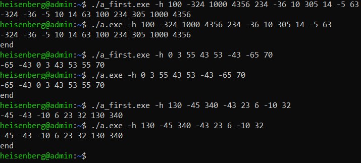

# ИДЗ по АВС № 1
## **Изменения в дизассемблированном коде**
- ### **максимальное использование регистров**
  В исходном коде все локальные переменные сохранялись в стеке. В изменённой программе все данные помещаются в регистры `rbx`, `r12-r15`.<br>

  #### *запись данных в исходном методе `main`:*
  ```
  mov	QWORD PTR -48[rbp], rsi
  mov	DWORD PTR -36[rbp], edi
  mov	QWORD PTR -24[rbp], rax
  mov	QWORD PTR -16[rbp], rax
  mov	DWORD PTR -8[rbp], eax
  mov	DWORD PTR -4[rbp], 0
  ```

  #### *использование регистров в исправленном методе `main`:*
  ```
  mov r12d, edi                   # r12d = edi = int argc
  mov r13, rsi                    # r13 = rsi = указатель на начало argv[]
  mov r14, rax                    # r14 = input
  mov r15, rax                    # r15 = output
  ```

  Таким образом вместо определённых участков памяти в стеке были использованы соответствующие регистры:
  ```
  DWORD PTR -36[rbp] -> r12d
  QWORD PTR -48[rbp] -> r13
  DWORD PTR -8[rbp] -> ebx
  QWORD PTR -16[rbp] -> r14
  DWORD PTR -4[rbp] -> r10d
  QWORD PTR -24[rbp] -> r15
  ```

  В файле `inserion.s ` аналогичное использование регистров.
- ### **изменение струкктуры программы**
  Изначальная дизассемблированная программа имела множество различных меток, из-за которых была плохая читаемость кода. В изменённой программе циклы и условия представлены в более понятном виде. <br>

  #### *пример цикла `for`:*
  ```
  .loop2_start:
        cmp r10d, ebx
        jge .loop2_end                  # if (i >= n) : цикл заканчивается

        lea rdx, 0[0+r10*4]             # rdx = [i * 4]
        lea rax, B[rip]                 # rax = указатель на начало массива B
        mov edx, dword ptr[rdx + rax]   # edx = B[i]
        mov rdi, r15                    # rdi = output
        lea	rsi, .LC4[rip]				# rsi = "%d "
        mov dword ptr -4[rbp], r10d     # [rbp - 4] = i

        call fprintf@PLT				# fprintf(output, "%d ", B[i])
        mov r10d, dword ptr -4[rbp]     # i = [rbp - 4]
        add r10d, 1                     # ++i
        jmp .loop2_start
    .loop2_end:
    jmp .end
  ```

  #### *пример условия `if`:*
  ```
    cmp	edx, eax						    # compare(B[j - 1], B[j])

    jle	.if_not					            # if (B[j - 1] <= B[j]) : переход в if_not
        mov r15d, edx                         # temp = B[j - 1]
        mov	r10d, r14d			            # r10d = j
	    lea	ecx, -1[r10]					# ecx = [j - 1]
        movsx r11, ecx					    # r11 = [j - 1]
	    lea	rcx, 0[0+r11*4]					# rcx = [(j - 1) * 4]
	    lea	r11, B[rip]						# r11 = указатель наначало массива B
	    mov	DWORD PTR [rcx+r11], eax		# B[j - 1] = B[j]

        lea	rcx, 0[0+r10d*4]				# rcx = [j * 4]
	    mov	DWORD PTR [rcx+r11], r15d		# B[j] = temp = B[j - 1]
            
    .if_not:
  ```
  Благодаря подобным измененеиям код стал гораздо понятнее при чтении и также сократилось количество строк. Было 285, стало 261. Код находится в файлах `main.s` и `insertion.s`, так же в них есть подробные комментарии, описывающие работу программы.

## **Функциональность программы**
- ### **ввод данных с клавиатуры**
  Чтобы ввести элементы массива с клавиатуры, нужно в командной строке ввести флаг `-h` и после него через пробел прописать числа.
  
  #### *пример:*
  > gcc ./a.exe -h 3 -20 324 32 0 -45 100

  #### *тесты:*

  > 

  `a_first.exe` запускает первоначальную правильную программу, `a.exe` нашу изменённую. Ответы свопадают, значит наша программа работает верно.


- ### **ввод данных с файла и запись результата в файл**
  Чтобы ввести элементы массива с текстового файла, нужно в командной строке ввести флаг `-f` и после него написать название входного файла, затем название выходного файла и в конце размер массива.
  
  #### *пример:*
  > gcc ./a.exe -f input.txt output.txt 15

  #### *тесты:*

  > 

  > 

  > 

  `a_first.exe` записал в свои выходные файлы такие же ответы, что и `a.exe`

- ### **генерация случайных чисел**
  чтобы сгенерировать элементы массива случайным образом, нужно в командной строке ввести флаг `-r`.

  #### *пример:*
  > gcc ./a.exe -r
  #### *тесты:*
  > 

  `a.exe` генерирует случайную длину и случайные числа и правильно их сортирует.

## **Производительность программы**
  Оптимизации должны сократить время работы программы.
  #### *тест производительности:*
  > 

  Видно, что `a.exe` работает гораздо быстрее чем `a_first.exe`. Значит, наша программа лучше по производительности.


