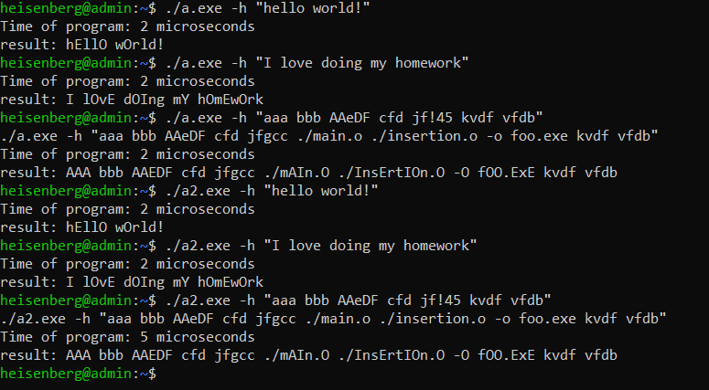
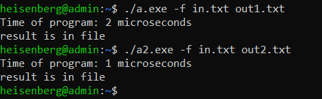
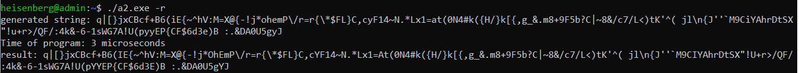

# ИДЗ по АВС № 2
## **Изменения в дизассемблированном коде**
- ### **максимальное использование регистров**
  В исходном коде все локальные переменные сохранялись в стеке. В изменённой программе все данные помещаются в регистры `rbx`, `r12-r15`.<br>

  #### *запись данных в исходном методе `main`:*
  ```
  mov	DWORD PTR -36[rbp], edi
  mov	QWORD PTR -48[rbp], rsi
  mov	QWORD PTR -16[rbp], rax
  mov	QWORD PTR -24[rbp], rax
  mov	DWORD PTR -4[rbp], 0
  ```

  #### *использование регистров в исправленном методе `main`:*
  ```
  push r12	
  push r13	
  push r14
  push r15
  push rbx							
  ```

  Таким образом вместо определённых участков памяти в стеке были использованы соответствующие регистры:
  ```
  QWORD PTR -48[rbp] -> r12
  QWORD PTR -16[rbp] -> r13
  DWORD PTR -4[rbp] -> r14d
  QWORD PTR -24[rbp] -> r15
  DWORD PTR -4[rbp] -> ebx
  ```

  В файле `MyFunc.s` аналогичное использование регистров.
- ### **Удаление макросов**
  Были убраны такие команды как `endbr64` и `cdqe`. Также удалена ненужная информация в конце файла, которая была сгенерирована компилятором. Было 245, стало 230. Код находится в файлах `main.s` и `insertion.s`, так же в них есть подробные комментарии, описывающие работу программы.

## **Функциональность программы**
- ### **ввод данных с клавиатуры**
  Чтобы ввести элементы массива с клавиатуры, нужно в командной строке ввести флаг `-h` и после него ввести строку в двойных кавычках, чтобы пробелы ноормально считывались.
  
  #### *пример:*
  > gcc ./a.exe -h "hello world!"

  #### *тесты:*

  > 

  `a.exe` запускает первоначальную правильную программу, `a2.exe` нашу изменённую. Ответы свопадают, значит наша программа работает верно.


- ### **ввод данных с файла и запись результата в файл**
  Чтобы ввести элементы массива с текстового файла, нужно в командной строке ввести флаг `-f` и после него написать название входного файла, затем название выходного файла.
  
  #### *пример:*
  > gcc ./a.exe -f input.txt output.txt

  #### *тесты:*

  > 

  > 

  `a.exe` записал в свои выходные файлы такие же ответы, что и `a2.exe`

- ### **генерация случайных чисел**
  Чтобы сгенерировать элементы массива случайным образом, нужно в командной строке ввести флаг `-r`. Размер массива так же определяется случайным образом.

  #### *пример:*
  > gcc ./a.exe -r
  #### *тесты:*
  > 

  `a.exe` генерирует случайную длину и случайные числа и правильно их сортирует.

## **Производительность программы**
  Оптимизации должны сократить время работы программы.
  #### *тест производительности:*
  > 

  Видно, что `a.exe` работает гораздо быстрее чем `a_first.exe`. Значит, наша программа лучше по производительности. Так как сортировка массива при разных способах ввода данных работает одинаково, то при генериации случайных чисел и работе с файлами, наша программа будет так же лучше работать.


