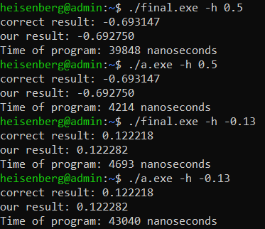
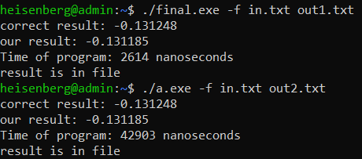
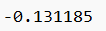
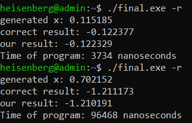

# ИДЗ по АВС № 3
## **Изменения в дизассемблированном коде**
- ### **максимальное использование регистров**
  В исходном коде все локальные переменные сохранялись в стеке. В изменённой программе все данные помещаются в регистры `rbx`, `r12, r13`.<br>

  #### *запись данных в исходном методе `main`:*
  ```
  mov	DWORD PTR -52[rbp], edi
  mov	QWORD PTR -64[rbp], rsi
  mov	QWORD PTR -8[rbp], rax
  mov	QWORD PTR -16[rbp], rax
  mov	QWORD PTR -24[rbp], rax
  mov	QWORD PTR -32[rbp], rax
  ```

  #### *использование регистров в исправленном методе `main`:*
  ```
  push r12	
  push r13
  push rbx							
  ```

  Таким образом вместо определённых участков памяти в стеке были использованы соответствующие регистры:
  ```
  r12d = strcmp(argv[i], "-h")
  r13 = output
  rbx = указатель на начало argv
  ```

  В файле `second_MyFunc.s` аналогичное использование регистров.
- ### **Удаление макросов**
  Были убраны такие команда `endbr64`. Также программа была оптимизирована путём удаления ненужных перемещений данных из регистров в регистры. Было 184 строк код, стало 157. Код находится в файлах `second_main.s` и `second_MyFunc.s`, так же в них есть подробные комментарии, описывающие работу программы.

## **Функциональность программы**
- ### **ввод данных с клавиатуры**
  Чтобы ввести число x с клавиатуры, нужно в командной строке ввести флаг `-h` и после него ввести десятичное число. Так как при вычисления интеграла степенной ряд сходится при |x| < 1, то при значении больше 1 программа будет выводить бесконечность.
  
  #### *пример:*
  > ./final.exe -h 0.75

  #### *тесты:*

  > 

  `a.exe` запускает первоначальную правильную программу, `final.exe` нашу изменённую. Ответы свопадают, значит наша программа работает верно.


- ### **ввод данных с файла и запись результата в файл**
  Чтобы ввести число x с текстового файла, нужно в командной строке ввести флаг `-f` и после него написать название входного файла, затем название выходного файла.
  
  #### *пример:*
  > ./a.exe -f input.txt output.txt

  #### *тесты:*

  > 

  > 

  `final.exe` записал в свои выходные файлы такие же ответы, что и `a.exe`

- ### **генерация числа**
  Чтобы сгенерировать число случайным образом, нужно в командной строке ввести флаг `-r`. Число будет меньше 1 по модулю.

  #### *пример:*
  > gcc ./a.exe -r
  #### *тесты:*
  > 

  `final.exe` генерирует случайную строку и строчные гласные буквы переводит в заглавные.

## **Производительность программы**
  Так как для вычисления ln(1 - x) с точностью 0.1%, то для этого требуется не так много выполнений команд, и скорость работы программы примерно одинаковая.

## **Оценка**
  По критерием работы выполнена на оценку 9