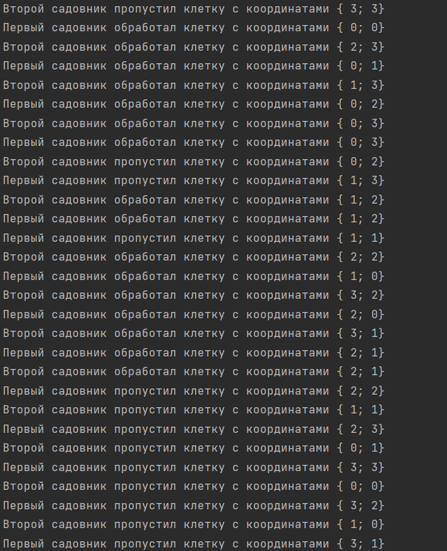

# ИДЗ по АВС № 4
## **Описание программы**
- ### **модель параллельных выичслений**
  Я сделал многопоточное приложение, использовав модель итеративный параллелизм, так как в задаче есть два садовника, которые должны обойти всё поле, и раелизация данной модели осуществлена через циклы.

  #### *пример цикла:*
  ```
    while (count != height * length) {
        if (arr[0] == arr[2] && arr[1] == arr[3]) {
            pthread_mutex_lock(&mutex);
            if (field[arr[2]][arr[3]] == 0) {
                usleep(500000);
                printf("Второй садовник обработал клетку с координатами { %d; %d}\n", (int)arr[2], (int)arr[3]);
                field[arr[2]][arr[3]] = 1;
            } else {
                printf("Второй садовник пропустил клетку с координатами { %d; %d}\n", (int)arr[2], (int)arr[3]);
            }
            pthread_mutex_unlock(&mutex);
        } else {
            if (field[arr[2]][arr[3]] == 0) {
                usleep(500000);
                printf("Второй садовник обработал клетку с координатами { %d; %d}\n", (int)arr[2], (int)arr[3]);
                field[arr[2]][arr[3]] = 1;
            } else {
                printf("Второй садовник пропустил клетку с координатами { %d; %d}\n", (int)arr[2], (int)arr[3]);
            }
        }
        usleep(500000);
        if (directionUp) {
            if (arr[2] == 0) {
                --arr[3];
                directionUp = false;
            } else {
                --arr[2];
            }
        } else {
            if (arr[2] == height - 1) {
                --arr[3];
                directionUp = true;
            } else {
                ++arr[2];
            }
        }
        ++count;
    }
  ```
  Данный цикл осущевствляет прохождение одного из садовников по полю и обработке его.  
- ### **описание сценария** 
  У нас имеются два садовника. Первый начинает с левого верхнего угла, воторой с правого нижнего, и двигаются они в соотвтствии с условием задачи. Если же получится так, что садовник переместится в клетку, которая занята другим садовником, то он ждёт освобождения этой клетки, после чего проходит дальше свой путь. И таким образом садовники должны работать одновременно до тех пор, пока каждый из них не пройдёт полностью поле.
- ### **описание алгоритма** 
  Изначально создаётся поле в виде динамического двумерного массива. Затем создаются 2 потока, в которых будут работать двух функции.<br>
  Работа садовников осущевствляется в этих функциях. `func1` отвечает за работу первого садовника, `func2` за работу второго. В каждой из этих функциях есть цикл while, которые моделируют проход каждого садовника по полю. Так же в параметрах этих функций есть аргументы, которые представляют из себя координаты первого и второго садовников. Если координаты садовников равны, то мы тогда блокируем мьютекс и разблокировываем его после того, как мы обработали клетку с данными координатами. Благодаря этому какой-то из садовников будет ждать до тех пор, пока клетка не освободится и не разблокируется.
  #### *пример:*
  ```
    if (field[arr[2]][arr[3]] == 0) {
        usleep(500000);
        printf("Второй садовник обработал клетку с координатами { %d; %d}\n", (int)arr[2], (int)arr[3]);
        field[arr[2]][arr[3]] = 1;
    } else {
        printf("Второй садовник пропустил клетку с координатами { %d; %d}\n", (int)arr[2], (int)arr[3]);
    }
    pthread_mutex_unlock(&mutex);
  ```
  Так же если садовнику не приходится обрабатывать клетку, то он проходит её за пол секунды, иначе за одну секунду. В методе `main` мы создаём мьютекс, два потока, передаём туда наши функции, после чего ожидаем их завершения.
  ```
    pthread_t t1, t2; // создаём потоки и мьютекс
    pthread_mutex_init(&mutex, nullptr);
  
    pthread_create(&t1, nullptr, &func1, args);
    pthread_create(&t2, nullptr, &func2, args);

    pthread_join(t1, nullptr); // ждём окончание выполнения потоков
    pthread_join(t2, nullptr);
                            
    pthread_mutex_destroy(&mutex)  
  ```


## **Функциональность программы**
В моей программе нужно ввести длину и ширину поля. Длина и ширина поля могут быть от 5 до 40.
- ### **ввод данных с клавиатуры**
  Чтобы ввести данные с консоли, нужно в командной строке ввести флаг `-c`, после чего ввести два числа. 
  
  #### *пример:*
  > ./a.out -c

- ### **ввод данных с файла**
  Чтобы ввести число x с текстового файла, нужно в командной строке ввести флаг `-f` и после него написать название входного файла.
  
  #### *пример:*
  > ./a.out -f input.txt

- ### **генерация случайных данных**
  Чтобы длину и ширину поля случайным образом, нужно в командной строке ввести флаг `-r`. числа будут от 5 до 40.

  #### *пример:*
  > ./a.out -r

- ### **ввод данных с командной строки**
  Чтобы ввести данные с командной строки, нужно в командной строке ввести флаг `-l` и после него ввести два числа. 

  #### *пример:*
  > ./a.out -l 10 10

## **Вывод данных**  
  Работа программы выводится только в консоль, так как только так можно увидеть, как садовники работают параллельно друг другу, и за как быстро они могут пройти всё поле.
  #### *пример вывода:*
  > 

## **Оценка**
  По критерием работы выполнена на оценку 8